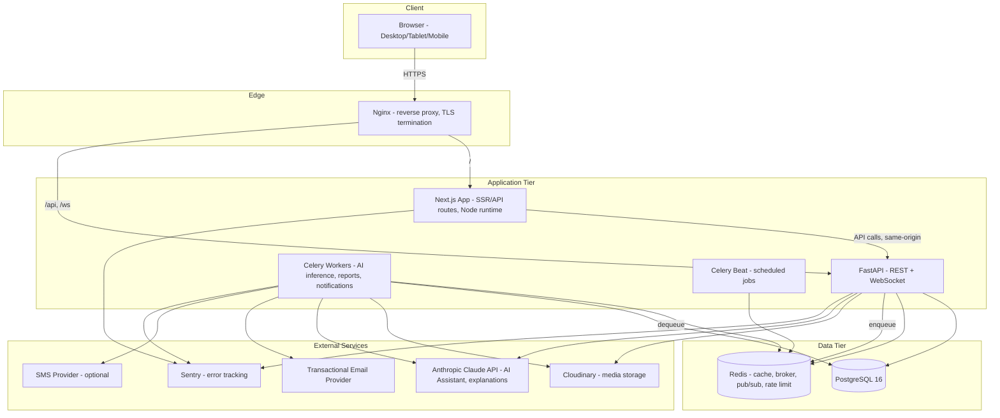

# High-Level Architecture (HLD)

Technical blueprint for NurseryVerse AI, built directly on the Phase 1–3 product/UX/design decisions. This document is the "how the system is built" counterpart to Phase 1–3's "what it does and looks like."

## 1. Architectural Style Decision

**Modular monolith, not microservices.** The backend is one FastAPI application internally organized into strict feature modules (Clean Architecture layering, per §3), deployed as a small number of containers (api, worker, beat), not a constellation of independently-deployed services. This is a deliberate choice against microservices, justified by NFR-2.1's actual scale target (50 concurrent orgs, 500 concurrent users at launch) — that scale does not need independent service scaling, and microservices would add distributed-systems complexity (network calls replacing function calls, distributed transactions, service-mesh operational overhead) without a corresponding benefit at this stage. Module boundaries are still enforced at the code level (import-linting, per Backend Architecture §2) so any module *could* be extracted into its own service later (the AI modules are the most likely future candidate, given their distinct scaling/resource profile — GPU inference vs. CPU web serving) without a rewrite, but that extraction is explicitly not done in v1.

## 2. Overall System Architecture

## 3. Frontend Architecture (summary — full detail in `04-frontend-architecture.md`)

Next.js 14+ (App Router), TypeScript strict mode, deployed as a standalone Node.js server (Next.js `output: 'standalone'`) in its own container — not statically exported, since authenticated, per-request-personalized dashboards are the primary use case, not static marketing pages (the one static page, PG-01 Landing, is still served by the same Next.js app via static generation). The frontend talks to the FastAPI backend over same-origin HTTPS (proxied by Nginx) for REST calls and a dedicated WebSocket path for realtime.

## 4. Backend Architecture (summary — full detail in `03-backend-architecture.md`)

FastAPI (async), Clean Architecture layering (`api → services → repositories → models`), one deployable image serving both the synchronous REST/WebSocket API and, via a separate entrypoint of the same codebase, Celery workers — same codebase, different process roles, which keeps module boundaries identical between the request path and the background-job path.

## 5. AI Architecture (summary — full detail in `06-ai-architecture.md`)

AI inference logic lives inside the same backend codebase (`app/ai/`), not a separate service, for the reasons in §1. Short-latency inference (single disease scan, single water recommendation) runs inline in the FastAPI request path; longer/batch inference (revenue forecast, org-wide survival re-scan) runs via Celery. All AI modules share a common model-registry and prediction-logging interface (per FR-8.7).

## 6. Database Architecture (summary — full detail in `05-database-architecture.md`)

Single PostgreSQL 16 instance (v1 scale does not warrant sharding or a multi-database-per-tenant approach), shared-schema multi-tenancy with `nursery_id`/`branch_id` scoping enforced by both application middleware and PostgreSQL Row-Level Security.

## 7. Infrastructure Architecture (summary — full detail in `09-infrastructure.md`)

Docker Compose orchestrates: `nginx`, `web` (Next.js), `api` (FastAPI/Uvicorn), `worker` (Celery), `beat` (Celery beat), `postgres`, `redis`. This is the full v1 production topology for the single reference customer, matching BRD's "self-contained Docker Compose stack" constraint (BRD §8) and NFR-9.1's cloud-portability requirement.

## 8. External Services

| Service | Purpose | Why external (not self-hosted) |
|---|---|---|
| Cloudinary | Plant images, generated PDF/document storage, image transformation (thumbnails) | Purpose-built for media transform/CDN delivery; self-hosting equivalent (image processing + CDN) is out of proportion to this product's core value |
| Anthropic Claude API | AI Assistant conversational engine, AI-generated plain-language explanations (recommendation narratives) | Frontier LLM capability is not something to self-host at this stage |
| Transactional email provider (e.g., Postmark/SES-class) | Invites, password resets, email notifications, invoice delivery | Deliverability (SPF/DKIM/reputation) is a specialized concern, not core product value |
| SMS provider (e.g., Twilio-class) | Optional critical notifications (FR-17.3) | Same rationale as email |
| Sentry (or equivalent) | Error tracking (NFR-10.2) | Cross-cutting observability tooling, not product logic |

No other external SaaS dependency exists — the rest of the stack (Postgres, Redis, Nginx, the app tiers) is self-hosted within the Docker Compose stack, preserving the "no single cloud provider lock-in" requirement (NFR-9.1); the external services above are deliberately chosen to be swappable (each sits behind an internal adapter interface in `app/integrations/`, per Backend Architecture §2) rather than deeply coupled into business logic.

## 9. Cloud Architecture

v1 targets a single Docker-host deployment (one VM/server capable of running the full Compose stack — sized per NFR-2.1's scale target) on any standard cloud VM provider (AWS EC2, DigitalOcean Droplet, GCP Compute Engine, or equivalent) — the choice of provider is an ops decision at deployment time, not an architectural dependency, per NFR-9.1. A managed PostgreSQL service (e.g., RDS-equivalent) is recommended over self-hosting Postgres in the same Compose stack for production (simplifies backup/patching, per NFR-3.2) while remaining API-compatible with the Docker Compose local/staging setup, which runs Postgres as a container for parity and ease of local development.

**Scaling path beyond v1 (not built now, but architecturally not precluded):** the `api` and `worker` services are stateless and horizontally scalable behind a load balancer once a single host's capacity is exceeded (NFR-2.1/2.3); Redis and Postgres would move to managed clustered offerings at that point. This document intentionally does not over-build for that scale now (YAGNI), consistent with the modular-monolith decision in §1.

## 10. Deployment Architecture

Single-environment-per-host model: `docker-compose.yml` for local development, `docker-compose.prod.yml` (production overrides — resource limits, restart policies, no bind-mounted source code, production env file) for the deployed environment. Images are built in CI (per `10-devops.md`), pushed to a container registry, and pulled by the host on deploy — the host never builds from source directly in production. Full detail, including zero-downtime rollout considerations, is in `10-devops.md`.
