# Database Architecture

PostgreSQL 16. This document defines the architectural contract (entities, relationships, constraints strategy, indexing strategy, transactions, audit, backup, multi-tenancy) — the literal DDL, SQLAlchemy models, and Alembic migrations are produced in Phase 5, against this blueprint.

## 1. Complete ERD

```mermaid
erDiagram
    NURSERIES ||--o{ BRANCHES : has
    NURSERIES ||--o{ USERS : "owns (via employees)"
    NURSERIES ||--o{ SPECIES : owns
    NURSERIES ||--o{ SUBSCRIPTIONS : has
    NURSERIES ||--o{ ROLES : "defines (custom)"

    BRANCHES ||--o{ EMPLOYEES : staffs
    BRANCHES ||--o{ PLANTS : houses
    BRANCHES ||--o{ INVENTORY : stocks
    BRANCHES ||--o{ SALES : records
    BRANCHES ||--o{ SUPPLIERS : "sources via"
    BRANCHES ||--o{ ENVIRONMENTAL_READINGS : monitors

    USERS ||--o{ EMPLOYEES : "is (per org)"
    USERS ||--o{ ROLE_ASSIGNMENTS : has
    ROLES ||--o{ ROLE_ASSIGNMENTS : "granted via"
    ROLES ||--o{ ROLE_PERMISSIONS : has
    PERMISSIONS ||--o{ ROLE_PERMISSIONS : "included in"

    SPECIES ||--o{ PLANTS : classifies

    PLANTS ||--o{ PLANT_IMAGES : has
    PLANTS ||--o{ GROWTH_TIMELINE : logs
    PLANTS ||--o{ HEALTH_HISTORY : logs
    PLANTS ||--o{ DISEASE_REPORTS : has
    PLANTS ||--o{ ENVIRONMENTAL_READINGS : "measured at"
    PLANTS ||--o{ WATERING_LOGS : has
    PLANTS ||--o{ AI_PREDICTIONS : "predicted for"
    PLANTS ||--o{ PLANT_TRANSFERS : "moved via"
    PLANTS ||--o{ PASSPORTS : "documented by"
    PLANTS ||--o{ SALE_ITEMS : "sold via"

    DISEASE_REPORTS ||--o{ TREATMENTS : receives

    INVENTORY ||--o{ INVENTORY_ADJUSTMENTS : has
    INVENTORY ||--o{ SALE_ITEMS : "sold via"
    INVENTORY ||--o{ PURCHASE_ORDER_ITEMS : "received via"

    SUPPLIERS ||--o{ PURCHASE_ORDERS : fulfills
    PURCHASE_ORDERS ||--o{ PURCHASE_ORDER_ITEMS : contains

    CUSTOMERS ||--o{ SALES : makes
    CUSTOMERS ||--o{ INVOICES : "billed via"

    SALES ||--o{ SALE_ITEMS : contains
    SALES ||--o{ INVOICES : "invoiced via"
    INVOICES ||--o{ INVOICE_ITEMS : contains

    AI_ASSISTANT_CONVERSATIONS ||--o{ AI_ASSISTANT_MESSAGES : contains

    USERS ||--o{ NOTIFICATIONS : receives
    USERS ||--o{ NOTIFICATION_PREFERENCES : sets
    USERS ||--o{ AUDIT_LOGS : "acts (as actor)"
    USERS ||--o{ AI_ASSISTANT_CONVERSATIONS : has
```

*(Full column-level attributes are defined in Phase 5's schema document, not duplicated here — this ERD is the architectural relationship map.)*

## 2. Entity Catalog

| Entity | Tenant scope | Lifecycle type | Notes |
|---|---|---|---|
| `nurseries` | Self (the tenant root) | Mutable profile | One row per Org |
| `branches` | Org | Soft-delete (status) | |
| `users` | Cross-org possible in theory, but v1 constrains one user to one org | Mutable | Auth identity |
| `employees` | Org + Branch(es) | Soft-delete (deactivate) | Links `users` to an Org with role/branch context |
| `roles`, `permissions`, `role_permissions` | Org (custom roles) / global (system roles) | Reference | |
| `role_assignments` | Org | Mutable | User ↔ Role, per Org |
| `species` | Org | Mutable | |
| `plants` | Branch | Lifecycle state machine (`docs/ux/13-digital-twin-lifecycle.md`) | Core entity |
| `plant_images` | Branch (via plant) | Append-only | |
| `growth_timeline`, `health_history`, `environmental_readings`, `watering_logs` | Branch (via plant) | Append-only | |
| `disease_reports` | Branch (via plant) | Lifecycle state machine | |
| `treatments` | Branch (via disease_report) | Append-only | |
| `ai_predictions` | Branch (via plant) or Org (revenue) | Append-only, versioned | Universal logging contract (FR-8.7) |
| `ai_recommendations` | Branch | Mutable (dismiss/act status) | |
| `plant_transfers` | Org (spans branches) | Append-only | |
| `passports` | Branch (via plant) | Append-only, versioned | Includes public token |
| `inventory` | Branch | Mutable quantity | |
| `inventory_adjustments` | Branch (via inventory) | Append-only | |
| `sales`, `sale_items` | Branch | Lifecycle (completed/voided) | |
| `customers` | Branch (created), visible org-wide for Owner/Admin | Mutable | |
| `invoices`, `invoice_items` | Branch | Lifecycle state machine | |
| `suppliers` | Branch | Mutable | |
| `purchase_orders`, `purchase_order_items` | Branch | Lifecycle state machine | |
| `notifications` | User (recipient) | Mutable (read state) | |
| `notification_preferences` | User | Mutable | |
| `reports` | Org/Branch (generator metadata) | Append-only | |
| `audit_logs` | Org | Append-only, immutable (no update/delete grant at all) | |
| `org_settings`, `subscriptions`, `usage_counters` | Org | Mutable | |
| `ai_assistant_conversations`, `ai_assistant_messages` | User | Append-only (messages), mutable (conversation metadata) | |

## 3. Relationships & Cardinality Notes

`nurseries 1—N branches` is the tenant/operational-boundary split established in `docs/ux/08-information-architecture.md`. `plants N—1 species` (many plants reference one species; species is never deleted while plants reference it — `species:delete` is blocked at the service layer if referenced, not just a DB constraint surprise). `plants 1—N` across five history tables (growth/health/environmental/watering/predictions) is the Digital Twin's defining shape — all five share the same FK-to-plant pattern and the same "append-only" lifecycle type, architected identically on purpose (a consistent pattern here directly enables the shared audit/timeline UI components from Phase 3). `sales N—1 customers` is optional (a walk-in retail sale may have no linked customer) — `customer_id` is nullable on `sales`. `disease_reports 1—N treatments` — a single report can accumulate multiple treatment attempts before an outcome closes it.

## 4. Constraints

**Primary keys:** UUID (via `pgcrypto`'s `gen_random_uuid()`), not sequential integers — avoids leaking record counts/creation order across tenants and simplifies eventual multi-host ID generation. **Foreign keys:** `ON DELETE RESTRICT` by default (referenced-by-history rows block deletion — matches the soft-delete-only policy for Branches/Species/Employees); the append-only history tables (growth/health/environmental/watering) use `ON DELETE CASCADE` from `plants` only in the sense that a plant is never hard-deleted either (status transitions to Deceased, per the lifecycle doc — there is no `DELETE /plants/{id}` endpoint at all). **Check constraints:** enum-backed status columns (`plants.status`, `disease_reports.status`, `sales.status`, `invoices.status`, `purchase_orders.status`) use PostgreSQL native `ENUM` types matching the state machines defined in Phase 2/3, not free-text — an invalid status value is a database-level impossibility, not just an application-level bug. **Uniqueness:** `(nursery_id, botanical_name)` unique on `species`; `(nursery_id, email)` unique on `users`/`employees` invite context; `plants.qr_code_token` globally unique.

## 5. Indexing Strategy

Every tenant-scoped table is indexed on `(nursery_id, branch_id)` (or just `nursery_id` where branch isn't applicable) as the leading composite index — since every query is tenant-scoped first (per NFR-2.2's per-tenant isolation performance requirement), this ordering keeps query plans efficient regardless of overall table size. Additional indexes: `plants(status)` and `plants(species_id)` for list-view filtering; `ai_predictions(plant_id, prediction_type, created_at DESC)` for "latest prediction per module" lookups (the most frequent AI query pattern, per `docs/ux/09-page-inventory.md`'s PG-26); `disease_reports(status, severity)` for the triage list (PG-29); `sales(branch_id, created_at DESC)` for Sales History's default sort; `audit_logs(nursery_id, created_at DESC)` and a secondary `audit_logs(actor_id)` for the two primary Audit Log query patterns; a `pg_trgm` GIN index on `customers.name` and `plants.common_name`/`species.common_name` supporting fuzzy global search (per `docs/ux/08-information-architecture.md` §5) and duplicate-customer detection (LLD, Customers module).

## 6. Transactions

Every multi-table write that must be all-or-nothing is wrapped in a single explicit transaction at the service layer (never left to implicit per-statement autocommit): Sale completion (sale + sale_items + plant status/inventory update), PO receiving (PO item + inventory update), Plant transfer (plant branch_id + transfer history + both branches' inventory if applicable), Employee deactivation (user session revocation + employee status + audit log). Isolation level: `READ COMMITTED` (PostgreSQL default) for standard operations; the availability-check-then-decrement path in Sales (FR-13.2) additionally uses a `SELECT ... FOR UPDATE` row lock on the target plant/inventory row within the transaction to close the race-condition window between check and commit under concurrent POS terminals at the same branch.

## 7. Audit Strategy

Every mutating service-layer call passes through a shared audit interceptor (per `02-low-level-design.md`'s Audit Log module) that writes actor (`user_id`), action (`entity.action`, e.g., `plant.status_changed`), entity type/id, a before/after JSONB diff, and a timestamp — inside the same transaction as the mutation itself, so an audit-write failure rolls back the mutation (audit is not best-effort). `audit_logs` has no `UPDATE`/`DELETE` grant at the PostgreSQL role level for any application database role, including the one the API connects as — immutability is enforced below the application layer, not just by omitting an endpoint (FR-19.3, NFR-5.3's 12-month-minimum retention).

## 8. Backup Strategy

Automated daily `pg_dump` (logical backup) plus continuous WAL archiving (physical, point-in-time-recovery capable) to object storage, retained per NFR-5.3-adjacent operational policy (30 days rolling + monthly snapshots retained 12 months, aligned with audit-log retention). Backup restoration is tested on a defined cadence (quarterly, tracked as an ops runbook item — see `10-devops.md` §6 Disaster Recovery) rather than assumed to work; an untested backup is treated as equivalent to no backup for planning purposes.

## 9. Multi-Tenancy Approach

**Shared schema, row-level isolation** — restated and made concrete from `docs/ux/01-sitemap.md`/Phase 1 SRS: every tenant-scoped table carries `nursery_id` (and `branch_id` where applicable). Two enforcement layers: (1) **Application layer** — the tenant-scoping middleware (`03-backend-architecture.md` §8) attaches `org_id`/`branch_ids` to every request context, and every repository method requires that context as an explicit parameter (there is no repository method that queries "all plants" without a tenant filter — the type signature doesn't allow it). (2) **Database layer** — PostgreSQL Row-Level Security policies on every tenant-scoped table, keyed to session variables (`app.current_org_id`) set by the middleware at the start of each request's DB connection — this means even a hypothetical application-layer bug that forgot to filter by org would still be blocked at the database (defense in depth, directly satisfying NFR-4.3). This shared-schema approach (over schema-per-tenant or database-per-tenant) is chosen because it scales operationally to the target range (dozens to low-hundreds of orgs, NFR-2.1) without the migration/connection-pool-multiplication overhead schema-per-tenant would introduce at this scale — revisited only if a future Enterprise customer's compliance requirements demand physical data separation, at which point it becomes a per-customer deployment decision, not a default architecture change.
