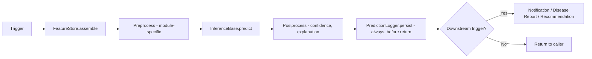
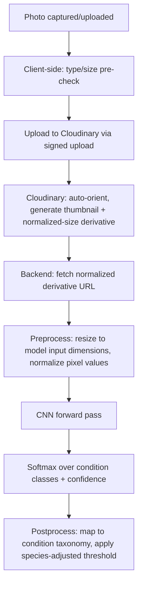
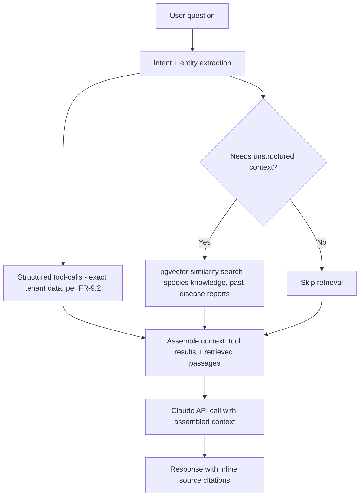

# AI Architecture

Technical architecture for the seven AI capabilities defined in `docs/product/04-functional-requirements.md` FR-8/FR-9 and workflow-mapped in `docs/ux/12-ai-workflow-diagrams.md`. This document defines *how* those workflows are implemented; Phase 9 (AI Implementation) builds against it.

## 1. AI Services (module map)

| Module | Package | Serving mode | Framework |
|---|---|---|---|
| Disease Detection | `app/ai/disease_detection/` | Sync (in-request) | PyTorch (CNN, transfer-learned) |
| Growth Prediction | `app/ai/growth_prediction/` | Sync (light) / async (batch) | Prophet + gradient boosting fallback |
| Survival Prediction | `app/ai/survival_prediction/` | Sync / async (batch) | XGBoost |
| Water Recommendation | `app/ai/water_recommendation/` | Sync | scikit-learn + rule layer |
| Revenue Forecast | `app/ai/revenue_forecast/` | Async (Celery, scheduled + on-demand) | Prophet |
| Recommendation Engine | `app/ai/recommendation_engine/` | Async (Celery, scheduled aggregation) | Feature-weighted scoring + LLM narrative |
| AI Assistant | `app/ai/assistant/` | Sync (streamed) | Anthropic Claude API, tool-calling |

All seven share `app/ai/common/`: `ModelRegistry` (versioned load/cache), `PredictionLogger` (enforces FR-8.7's universal logging contract), `FeatureStore` (shared feature-assembly utilities), `InferenceBase` (common interface every module implements).

## 2. Model Serving

Models run **in-process within the FastAPI/Celery worker Python runtime** (no separate model-serving infrastructure like Triton/TorchServe in v1) — justified by the same modular-monolith rationale as `01-high-level-architecture.md` §1: at launch scale, in-process serving avoids an extra network hop and an extra deployable, and PyTorch/XGBoost/scikit-learn models of this size (single-plant image classification, tabular prediction) serve well within a request's latency budget (NFR-1.2) without a dedicated inference server. `ModelRegistry.get(model_name, version="latest")` lazy-loads and caches weights per worker process (loaded once, reused across requests within that process's lifetime) — weights are read from Cloudinary-hosted (or equivalent object storage) artifacts at `models/<capability>/<version>/`, referenced by path in configuration (`.env`), not baked into the container image, so a new model version can be deployed by updating a config value and rolling the workers, without a full image rebuild.

**Scaling path (not built now):** if a future model becomes large enough to need GPU serving or independent scaling, it is extracted into a standalone inference service behind the same `InferenceBase` interface — the rest of the codebase would not need to change, since callers only depend on the interface, not the in-process implementation detail.

## 3. Inference Pipeline (shared shape across all modules)

Every module implements this exact shape (`preprocess → predict → postprocess → persist → conditional-trigger`) via `InferenceBase`'s template method — this is what makes the "no AI output without a persisted record" rule (FR-8.7) structural rather than a per-module discipline that could be forgotten: `PredictionLogger.persist()` is called by the base class itself, not by each module's implementation, so a module cannot accidentally skip it.

## 4. Feature Engineering

`FeatureStore` assembles module-specific feature vectors from the Digital Twin's raw history tables, with each module declaring its required feature set: Disease Detection consumes the raw image only (no tabular features — the model is purely visual, though species-level disease-susceptibility priors from `species.disease_susceptibility` are used to adjust the confidence threshold, not the classification itself). Growth Prediction consumes `growth_timeline` entries (measurement, days-since-planting) plus `species.growth_curve_baseline` when plant-specific history is thin. Survival Prediction consumes a composite feature set: recent `health_history` status trend, `environmental_readings` variance, `watering_logs` consistency (days-since-last vs. recommended interval), `disease_reports` count/severity history, and `species.disease_susceptibility`. Water Recommendation consumes `species.water_baseline`, recent `environmental_readings`, and `watering_logs` history. Revenue Forecast consumes `sales` aggregated by branch/period with seasonality decomposition. All feature assembly is tenant-scoped by construction (`FeatureStore` methods require an explicit `branch_id`/`plant_id`, never a global query) — consistent with the Database Architecture's multi-tenancy enforcement.

## 5. Image Processing (Disease Detection pipeline)

Cloudinary's on-upload transformation (auto-orient, derivative generation) offloads image preprocessing that would otherwise be custom backend code — a direct benefit of the Cloudinary architectural choice beyond just storage (per `01-high-level-architecture.md` §8). Uploads use Cloudinary's signed-upload pattern (backend issues a short-lived signed upload token; the client uploads directly to Cloudinary, not proxied through the FastAPI server) — reduces backend bandwidth load for what's otherwise the highest-volume upload path in the system (Priya's field photo-logging workflow).

## 6. Prediction Workflow

Fully diagrammed per-module in `docs/ux/12-ai-workflow-diagrams.md` (product-level) — this section adds the technical trigger mechanism: **event-triggered** modules (Disease Detection on photo submit, Growth/Survival/Water re-triggered on new relevant log entry) are invoked synchronously or enqueued directly from the owning service's mutation (e.g., `GrowthService.log_entry()` enqueues a Growth Prediction refresh as part of the same transaction's post-commit hook). **Schedule-triggered** modules (Revenue Forecast nightly, org-wide Survival re-scan, Recommendation Engine aggregation) are Celery Beat entries in `app/workers/beat_schedule.py`. **On-demand** modules (any module, triggered by a user action like "refresh forecast") go through the same service methods as their triggered counterparts — there is no separate code path for on-demand vs. triggered invocation, only a different caller.

## 7. Prompt Orchestration (AI Assistant)

`AssistantOrchestrator` manages a tool-calling loop against the Anthropic Claude API: system prompt establishes the assistant's role, tenant context (org name, current branch, user role), and hard constraints (never fabricate data, always cite the tool result a claim is based on, never execute a write without going through the confirmation flow). `AssistantToolRegistry` exposes a fixed set of tools mapped directly to existing service methods (read tools: `get_plant_summary`, `get_inventory_status`, `get_sales_summary`, `get_ai_predictions`; write tools: `propose_watering_log`, `propose_health_observation` — deliberately narrow, matching the branch-scoped write permissions in the permission matrix) — the LLM cannot call arbitrary code, only this registered, permission-checked set. Each tool invocation passes the requesting user's actual `RequestUser` context (org/branch/permissions) through to the underlying service call, so the model can never access data or propose actions the human user couldn't already reach directly (restated from `02-low-level-design.md`'s AI Assistant module security note).

## 8. Vector Search

`pgvector` (PostgreSQL extension, per `05-database-architecture.md` §9's extension list) stores embeddings for two purposes: (1) semantic search over Species care-requirement text and historical Disease Report descriptions, supporting the Assistant's ability to answer "what's wrong with plants like this one" style questions beyond exact keyword match; (2) a similarity index over past disease-report photo embeddings (extracted from an intermediate CNN layer, not a separate model) to support "have we seen this before" retrieval, feeding the RAG pipeline in §9. Embeddings are generated at write-time (new species record, new confirmed disease report) via a Celery task, not computed synchronously in the request path.

## 9. RAG Architecture (Assistant grounding)

Retrieval is always tenant-scoped (the `pgvector` similarity query includes an `org_id` filter identical to every other repository query, per the Database Architecture's multi-tenancy rule — there is no cross-tenant knowledge leakage risk in the RAG path). Structured tool-calls (exact numbers: "how many plants at Branch X") are preferred over retrieval-based answers wherever the question maps to a precise query — retrieval/RAG is reserved specifically for the fuzzier, knowledge-style questions (care guidance, "similar past issues") where an exact database query isn't the right tool, keeping the Assistant's factual claims about the business grounded in real queries rather than an LLM's approximation.

## 10. Model Versioning

Every model artifact is stored at `models/<capability>/<version>/` (object storage), with `version` a semantic identifier (`v1.0.0`) incremented on retrain/redeploy. `ai_predictions.model_version` (and `ai_recommendations.model_version`) records exactly which version produced each stored prediction — this is what makes historical predictions remain attributable after a model upgrade (a plant's survival-risk history shows which score came from which model generation, relevant when evaluating whether a retrain actually improved accuracy, per `docs/ux/18-analytics-workflow.md`'s prediction-accuracy tracking). `ModelRegistry` supports side-by-side loading of multiple versions (relevant during a staged rollout: serve v1.2.0 to a canary percentage of requests while v1.1.0 remains default) — the mechanism exists in the registry design even though v1 launch does not require a canary rollout process (that's a v1.1+ operational maturity step, not a v1 architectural gap).
