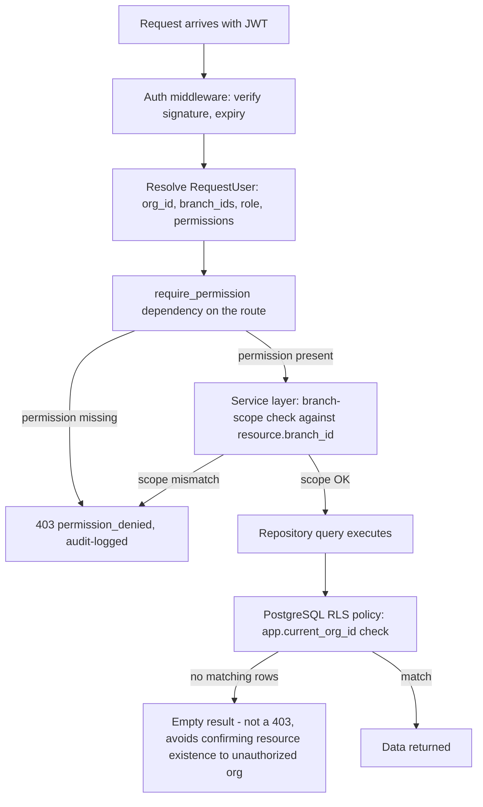

# Security Architecture

Consolidates and makes concrete every security-relevant NFR from `docs/product/05-non-functional-requirements.md` (NFR-4) and the permission model from `docs/ux/07-role-permission-matrix.md`.

## 1. JWT

RS256 (asymmetric — the API verifies with a public key, keeping the private signing key confined to the auth-issuing code path). Access token: 15-minute expiry, carries `user_id`, `org_id`, `branch_ids`, `role`, permission set (or a permission-version pointer if the set is large — resolved at `03-backend-architecture.md` implementation time), signed, not encrypted (no sensitive data beyond identity/scope in the payload). Refresh token: 14-day expiry, opaque random value (not a JWT itself), stored server-side hashed (never plaintext) with a Redis-backed revocation list keyed by token ID, rotated on every use (a used refresh token is immediately invalidated, preventing replay). Refresh token delivered as an `httpOnly`, `Secure`, `SameSite=Lax` cookie (never accessible to frontend JS), per `04-frontend-architecture.md` §6.

## 2. RBAC

Enforced identically to the design in `docs/ux/07-role-permission-matrix.md` — five system roles plus custom roles (Growth/Enterprise tier), atomic `<module>:<action>` permission codes, branch-scoped (`B`) permissions additionally checked against the resource's actual `branch_id`. RBAC is evaluated server-side on every request via `require_permission()` (`03-backend-architecture.md` §7) — the frontend's `PermissionGate`/nav-filtering is a UX convenience, never the authorization boundary itself (NFR-4.4's "never trust the client").

## 3. Permission Model (technical enforcement layers)

Three independent layers (application permission check, application branch-scope check, database RLS) must all agree for data to flow — this is the concrete implementation of the "defense in depth" principle stated throughout Phase 1–2 (NFR-4.3).

## 4. Encryption

**In transit:** HTTPS/WSS only, enforced at the Nginx edge (HTTP requests redirect to HTTPS, no unencrypted fallback path exists) — NFR-4.1. TLS termination at Nginx; internal container-to-container traffic (API↔Postgres, API↔Redis) runs within the private Docker network, not exposed externally, with credentials required regardless. **At rest:** database-level encryption at rest (enabled at the managed PostgreSQL provider level, per `01-high-level-architecture.md` §9's recommendation) covers all tables including PII (`users`, `customers`, `employees`). Refresh tokens and password-reset tokens are hashed (not merely encrypted) before storage, per §1. Cloudinary-hosted media is stored under the provider's own at-rest encryption, accessed only via signed URLs (no publicly-guessable direct file paths for non-passport content).

## 5. Secrets Management

All secrets (DB credentials, JWT signing key, Cloudinary API secret, Anthropic API key, SMTP/SMS provider credentials) are injected via environment variables at container start, sourced from the deployment platform's secret store (not committed to source control, per NFR-4.7 — `.env.example` documents required keys with placeholder/empty values only, `.env` itself is gitignored). The JWT signing private key specifically is never logged, never included in any API response, and rotated on a defined schedule (or immediately on suspected compromise) — rotation invalidates all outstanding access tokens (acceptable, since they're short-lived) and is handled without invalidating refresh tokens if avoidable (refresh tokens aren't JWT-signed, so a signing-key rotation doesn't inherently affect them).

## 6. Audit Logging

Restated from `05-database-architecture.md` §7: every mutating action logged with actor/action/entity/before-after-diff/timestamp, inside the same transaction as the mutation, immutable at the database grant level (FR-19.3). Security-relevant events specifically also logged even though they aren't a business-entity mutation in the usual sense: failed login attempts, permission-denied responses, password resets, role/permission changes — these feed both the standard Audit Log (PG-54, Owner/Admin visible) and, at volume, an anomaly-detection signal (e.g., a burst of failed logins from one account) that Phase 9's security review should define alerting thresholds for.

## 7. Rate Limiting

Redis-backed token-bucket, applied at the middleware layer (`03-backend-architecture.md` §8) before authentication resolves (protects the login/signup endpoints themselves from abuse) and after (protects authenticated endpoints from a compromised or misbehaving client). Tiers: general API — generous per-user limit tuned to normal UI usage patterns; `/auth/login`, `/auth/password-reset/*` — strict per-IP-and-per-email limit (NFR-4.6's lockout requirement); `/ai/*` — a distinct, plan-aware limit (ties into the metered-AI-usage billing model from BRD §5 — rate limiting and usage metering share the same counting mechanism rather than being two separate systems); `/passport/public/*` — strict per-token limit to prevent token brute-forcing (`02-low-level-design.md`'s Reports & Passport module security note).

## 8. Secure Uploads

Client-side pre-check (type/size) is a UX convenience only — the authoritative check is server-side (NFR-4.5): MIME-type verification by content inspection (not trusting the client-supplied `Content-Type` header), file-size cap enforced before the upload completes, image-dimension sanity check. Uploads to Cloudinary use short-lived signed upload tokens scoped to a specific folder/tenant path (per `06-ai-architecture.md` §5) — a compromised token cannot be used to overwrite or access another tenant's media. No uploaded file is ever executed or interpreted as code server-side (images are only ever passed to the image-processing/inference pipeline, never to a general file-open path).

## 9. OWASP Top 10 Considerations

| Risk | Mitigation |
|---|---|
| Broken Access Control | Three-layer RBAC/tenant-scoping per §3; every endpoint declares its required permission explicitly (no implicit "authenticated = authorized") |
| Cryptographic Failures | RS256 JWT, hashed passwords/tokens (argon2/bcrypt), TLS everywhere, encryption at rest |
| Injection | SQLAlchemy ORM with parameterized queries exclusively — no raw string-interpolated SQL anywhere in the codebase (enforced by code review + the repository-pattern boundary, which is the only layer allowed to construct queries at all) |
| Insecure Design | This entire Phase 4 document set — threat modeling implicit in the tenant-isolation, permission-tiering, and confirmation-gate (destructive actions, AI writes) decisions made throughout |
| Security Misconfiguration | `pydantic-settings` fail-fast config validation (`03-backend-architecture.md` §13) prevents the app from starting in a misconfigured state (e.g., missing signing key); security headers (HSTS, CSP, X-Frame-Options, X-Content-Type-Options) set at the Nginx edge |
| Vulnerable & Outdated Components | Dependency scanning as a CI gate (`10-devops.md` §1) |
| Identification & Authentication Failures | Rate-limited login, generic auth-failure messaging (no enumeration), rotating/revocable refresh tokens, session revocation on deactivation |
| Software & Data Integrity Failures | CI-built, signed/immutable container images pulled by tag/digest in production (`10-devops.md`), no runtime code-pulling from unpinned sources |
| Security Logging & Monitoring Failures | Structured logging + Sentry (NFR-10.1/10.2) + the Audit Log's independent, immutable trail (§6) |
| Server-Side Request Forgery (SSRF) | The `environmental-readings/ingest` API-key endpoint and any future outbound-URL-accepting feature validates/allowlists destinations; outbound calls to external services (§ integrations) go only to the fixed, configured provider hosts, never a user-supplied URL |

## 10. Security Review Gate

Per NFR-4.8, a dedicated security review (OWASP Top 10 at minimum, plus this document's tenant-isolation and AI-write-confirmation guarantees specifically) is a required, named step in Phase 9 (Integration & Testing) before Phase 10 deployment — not an optional nice-to-have, and not something Phase 6/7 implementation is assumed to have gotten right by default without independent verification.
