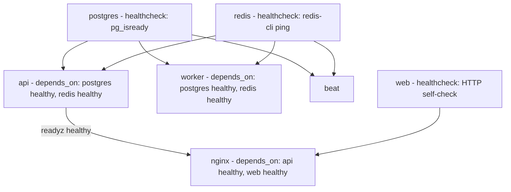

# Infrastructure

Concrete container/service topology implementing `01-high-level-architecture.md` §4/§7.

## 1. Docker Architecture

Five custom images, each with its own Dockerfile under `infra/docker/`: `web.Dockerfile` (Next.js, multi-stage build — `deps` → `builder` → `runner` using `output: 'standalone'`, final image contains only the compiled standalone server, not the full node_modules/dev toolchain), `api.Dockerfile` (FastAPI, multi-stage — dependency install layer cached separately from app-code layer for fast rebuilds, final image runs via Gunicorn with Uvicorn workers), `worker.Dockerfile` (same base as `api.Dockerfile`, different entrypoint — `celery -A app.workers worker`), and the `beat` process reuses the `worker` image with a different command (`celery -A app.workers beat`), not a separate image. `postgres` and `redis` use official upstream images (pinned to specific minor versions, not `latest`, per the immutable-build principle in `08-security-architecture.md` §9). Every image runs as a non-root user; the API/worker images do not include build tools or source-control metadata in the final layer (multi-stage build discards them).

## 2. Docker Compose

`docker-compose.yml` (local development — bind-mounts source for hot reload, exposes debug ports, uses a local `.env`) and `docker-compose.prod.yml` (production overlay — no bind mounts, resource limits per service, `restart: unless-stopped`, references pre-built images by tag rather than building in place). Service list matches `01-high-level-architecture.md` §7: `nginx`, `web`, `api`, `worker`, `beat`, `postgres`, `redis`. Inter-service communication happens over a private Compose network; only `nginx` publishes ports to the host. Each service declares a `healthcheck` (§10 below) so Compose's dependency ordering (`depends_on: condition: service_healthy`) prevents the API from starting against a Postgres that hasn't finished initializing, and prevents Nginx from routing to an API that hasn't passed its readiness check yet.

## 3. Nginx / Reverse Proxy

Single Nginx instance, responsibilities: TLS termination (cert managed via the deployment platform or Let's Encrypt/certbot, outside the scope of the Compose stack itself), routing (`/` → `web`, `/api/*` → `api`, `/ws/*` → `api` with `Upgrade`/`Connection` headers passed through for the WebSocket handshake), security headers (HSTS, CSP, X-Frame-Options, X-Content-Type-Options — per `08-security-architecture.md` §9), gzip/brotli compression for static assets, and request size limits (protects the upload endpoints from oversized payloads before they reach the application layer, redundant with but ahead of the application-level check in `08-security-architecture.md` §8).

## 4. Redis

Single Redis instance, logically partitioned by database index (not physically separate instances, at this scale): DB 0 — application cache (Species lookups, session/permission cache); DB 1 — Celery broker; DB 2 — Celery result backend; DB 3 — rate-limiting token buckets; DB 4 — WebSocket pub/sub channels; DB 5 — refresh-token revocation list. Partitioning by DB index (rather than key-prefixing within one DB) keeps `FLUSHDB`-scale operational commands (e.g., clearing the cache without touching the broker) safe and simple.

## 5. PostgreSQL

Version 16, with `pgcrypto`, `pg_trgm`, and `pgvector` extensions enabled (per `05-database-architecture.md` §5/`06-ai-architecture.md` §8). Connection pooling via PgBouncer (transaction-mode pooling) sitting between the API/worker processes and Postgres — necessary because the async FastAPI + multiple Celery worker processes would otherwise each hold their own connection pool, risking exhausting Postgres's `max_connections` at even moderate horizontal scale; PgBouncer centralizes and caps actual DB-side connections regardless of how many application processes are running.

## 6. Storage

Cloudinary (external, per `01-high-level-architecture.md` §8) for all media (plant images) and generated documents (invoices, reports, passports) — no local filesystem storage of user-generated content in any container (containers are treated as ephemeral/stateless, consistent with the horizontal-scaling path noted in the HLD).

## 7. Monitoring

Sentry (or equivalent) receives unhandled exceptions and explicitly-captured warnings from all three application services (web, api, worker) — NFR-10.2. Application-level metrics (AI inference latency/error rate per module, Celery queue depth per queue, per-tenant usage against plan limits) are exposed via a `/metrics` endpoint on the API (Prometheus-compatible format) — collection/dashboarding tooling (Prometheus + Grafana, or a managed equivalent) is a deployment-time choice layered on top of this endpoint, not baked into the application image itself, per the infrastructure-portability goal (NFR-9.1).

## 8. Logging

All three application services log structured JSON to stdout (`03-backend-architecture.md` §12); the container runtime's log driver forwards stdout to whatever the deployment platform aggregates logs with (CloudWatch, Loki, or equivalent) — again a deployment-time choice, not an application dependency, keeping the app portable across hosting providers.

## 9. Health Checks

Every service exposes a liveness/readiness distinction: `GET /healthz` (API) — process is up, no dependency checks, used for basic liveness; `GET /readyz` (API) — additionally checks DB and Redis connectivity, used to gate traffic routing (Nginx/load-balancer should not route to an API instance that's up but can't reach its dependencies). `web` (Next.js) exposes an equivalent lightweight health route. `worker`/`beat` report health via a Celery-native heartbeat mechanism monitored by the deployment platform's process supervisor rather than an HTTP endpoint (they don't serve HTTP traffic). `postgres`/`redis` use their respective images' built-in healthcheck commands (`pg_isready`, `redis-cli ping`).

## 10. Compose Health Check Wiring (concrete dependency graph)

