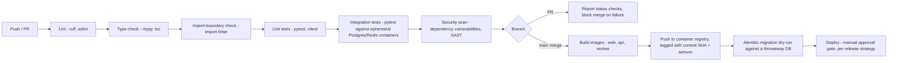

# DevOps

## 1. CI/CD Architecture

GitHub Actions, staged pipeline on every pull request and on merge to `main`:

Every stage must pass before the next runs; a PR cannot merge with a red status check (branch protection rule, §2). The migration dry-run (`L`) specifically catches a migration that would fail against production-shaped data before it's ever applied for real — a lesson encoded directly into the pipeline rather than left to manual discipline.

## 2. Branching Strategy

Trunk-based development: short-lived feature branches off `main`, merged via reviewed pull request, no long-lived `develop`/`staging` branches. `main` is always deployable — this is enforced by the CI gate above, not just a convention. Branch naming: `feature/<short-description>`, `fix/<short-description>`, `chore/<short-description>`. Chosen over GitFlow because the team/release cadence at this project's scale doesn't benefit from GitFlow's additional branch ceremony (release branches, develop/main sync overhead) — trunk-based keeps the single-team, frequent-small-releases pattern this project actually has simple.

## 3. Release Strategy

Semantic versioning (`MAJOR.MINOR.PATCH`) tagged on `main` at each release point. A release is: merge to `main` → CI builds and tags images with both the commit SHA (always) and the semver tag (on an explicit release commit) → manual approval gate (a human confirms the deploy, v1 does not auto-deploy every merge to production, given the single-reference-customer stakes) → deployment pulls the tagged images. Release notes are generated from merged PR titles/labels (conventional-commit-style discipline recommended but not yet mechanically enforced in v1's CI — flagged as a v1.1 tooling improvement, not a launch blocker).

## 4. Rollback Strategy

Because images are tagged and immutable (never overwritten, per `08-security-architecture.md` §9's integrity principle), rollback is: re-point the deployment to the previous known-good image tag and restart the affected service(s) — no rebuild required, minutes not hours. Database migrations are written to be backward-compatible for at least one release where feasible (additive changes deployed ahead of the code that depends on them, destructive changes — column drops — deployed only after the code no longer references them) specifically so a code rollback doesn't require an accompanying schema rollback in the common case. Where a migration genuinely cannot be made backward-compatible, the release runbook calls that out explicitly as a "rollback requires a DB restore, not just an image re-point" release, rather than assuming the general case applies.

## 5. Backup Strategy

Restated and operationalized from `05-database-architecture.md` §8: automated daily logical backup + continuous WAL archiving, 30-day rolling retention plus monthly snapshots retained 12 months. Backups are stored in a separate object-storage location from the application's own Cloudinary media (different provider/account boundary, so a single compromised credential can't destroy both the database backups and the primary data). Backup jobs alert on failure (not just log it) — a silently-failing backup job is treated as equivalent to having no backup strategy at all.

## 6. Disaster Recovery

**Targets:** RTO (Recovery Time Objective) of 4 hours, RPO (Recovery Point Objective) of 15 minutes for the database (bounded by the WAL-archiving interval) — chosen as reasonable for a single-reference-customer v1 deployment against NFR-3.1's 99.5% uptime target, revisited if an Enterprise SLA commitment (BRD §5) requires tighter numbers for a specific customer. **Runbook (high level):** provision a new host from the same Docker Compose definitions → restore the database from the most recent backup + WAL replay to the target point in time → redeploy the last known-good application images → verify via `/readyz` and a defined smoke-test checklist → cut over DNS/traffic. **Testing:** the restore procedure is exercised on a defined cadence (quarterly) against a non-production environment, not left untested until an actual incident — restated from the Database Architecture document because it's operationally significant enough to also live in the DevOps runbook context.

## 7. Environment Strategy

Three environments: **local** (developer machines, `docker-compose.yml`, seeded with synthetic data), **staging** (mirrors production topology, used for the migration dry-run and pre-release manual verification, non-production data only), **production** (the single reference customer's live environment, `docker-compose.prod.yml`). Configuration differs only via environment variables (`.env` per environment) — the same images run in all three, never an environment-specific build, per the immutable-artifact principle.
