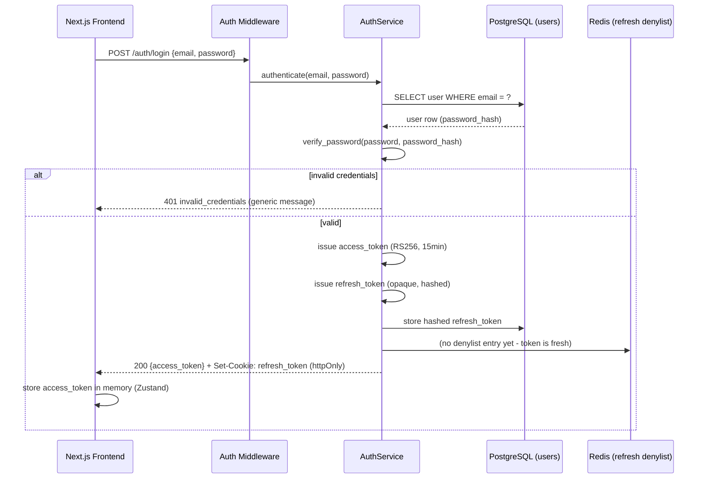
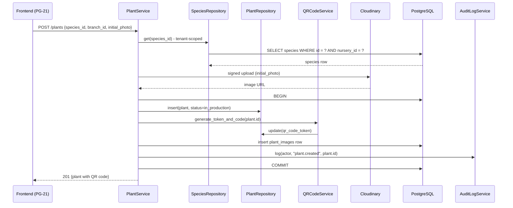
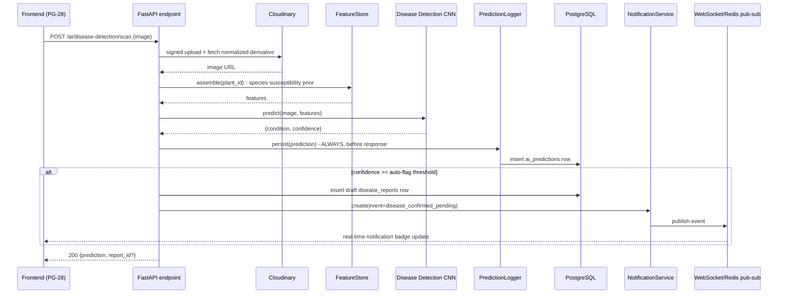
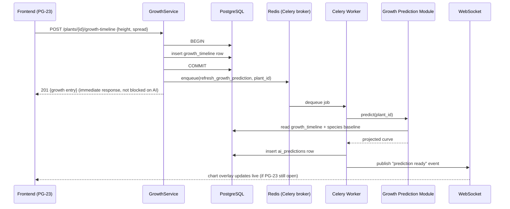
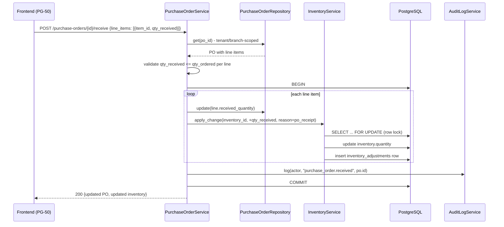
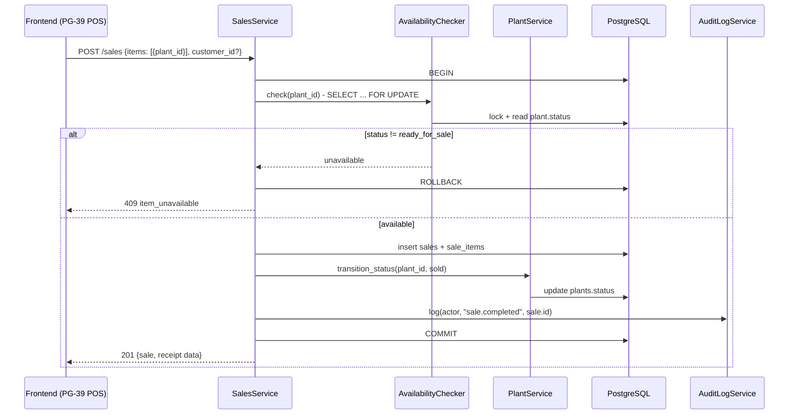
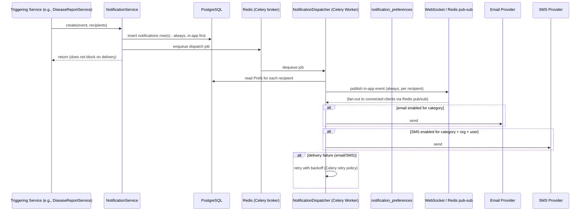

# Sequence Diagrams

Technical (component-level) sequence diagrams for the seven flows specified for this phase. These are more granular than the product-level flows in `docs/ux/03-screen-flow-diagrams.md` and `docs/ux/11-data-flow-diagrams.md` — every actor here is a concrete architectural component (service class, table, external system) defined earlier in this Phase 4 document set.

## 1. Login

## 2. Plant Registration

## 3. AI Disease Detection

## 4. Digital Twin Update (growth log triggers a prediction refresh)

## 5. Inventory Update (Purchase Order receipt)

## 6. Plant Sale

## 7. Notification Delivery

