# Complete Sitemap

Every page in the system is assigned a stable ID (`PG-##`) used consistently across this document set and, later, in routing, component naming, and test plans. IDs are grouped by module and are not resequenced if pages are added later (new pages get the next free ID in their module range).

## Sitemap Tree

```
NurseryVerse AI
├── Public (unauthenticated)
│   ├── PG-01 Landing / Marketing Page
│   ├── PG-02 Sign Up
│   ├── PG-03 Log In
│   ├── PG-04 Forgot Password
│   ├── PG-05 Reset Password
│   └── PG-06 Accept Invite
│
└── App Shell (authenticated, org-scoped)
    ├── Core
    │   ├── PG-07 Org Dashboard
    │   ├── PG-08 Branch Dashboard
    │   ├── PG-09 Notification Center
    │   └── PG-10 AI Assistant
    │
    ├── Organization & Branches
    │   ├── PG-11 Branches List
    │   ├── PG-12 Branch Detail / Settings
    │   └── PG-13 Create / Edit Branch
    │
    ├── Employees
    │   ├── PG-14 Employees List
    │   ├── PG-15 Employee Detail
    │   └── PG-16 Invite Employee
    │
    ├── Species Catalog
    │   ├── PG-17 Species List
    │   ├── PG-18 Species Detail
    │   └── PG-19 Create / Edit Species
    │
    ├── Plants (Digital Twin)
    │   ├── PG-20 Plants List
    │   ├── PG-21 Create Plant
    │   ├── PG-22 Plant Digital Twin Detail
    │   │   ├── PG-23 Growth Timeline (tab)
    │   │   ├── PG-24 Health History (tab)
    │   │   ├── PG-25 Environmental & Watering (tab)
    │   │   └── PG-26 AI Predictions (tab)
    │   └── PG-27 Transfer Plant (modal)
    │
    ├── Disease & Health
    │   ├── PG-28 AI Disease Detection Scan
    │   ├── PG-29 Disease Reports List
    │   └── PG-30 Disease Report Detail
    │
    ├── AI Predictions Center
    │   ├── PG-31 AI Predictions Dashboard
    │   ├── PG-32 Revenue Forecast
    │   └── PG-33 Recommendation Feed
    │
    ├── Watering
    │   ├── PG-34 Watering Schedule / Tasks
    │   └── PG-35 Log Watering Event (modal)
    │
    ├── Inventory
    │   ├── PG-36 Inventory List
    │   ├── PG-37 Inventory Item Detail
    │   └── PG-38 Adjust Stock (modal)
    │
    ├── Sales / POS
    │   ├── PG-39 POS / New Sale
    │   ├── PG-40 Sales History
    │   └── PG-41 Sale / Receipt Detail
    │
    ├── Customers
    │   ├── PG-42 Customers List
    │   └── PG-43 Customer Detail
    │
    ├── Invoices
    │   ├── PG-44 Invoices List
    │   ├── PG-45 Invoice Detail
    │   └── PG-46 Create Invoice
    │
    ├── Suppliers & Purchasing
    │   ├── PG-47 Suppliers List
    │   ├── PG-48 Supplier Detail
    │   ├── PG-49 Purchase Orders List
    │   └── PG-50 Purchase Order Detail / Create
    │
    ├── Reports
    │   ├── PG-51 Reports Hub
    │   ├── PG-52 Report Export / Builder
    │   └── PG-53 Plant Passport View
    │
    ├── Audit Log
    │   └── PG-54 Audit Log Viewer
    │
    └── Settings
        ├── PG-55 Org Profile Settings
        ├── PG-56 Billing & Plan
        ├── PG-57 Roles & Permissions
        ├── PG-58 Notification Preferences
        └── PG-59 Integrations Settings
```

## Sitemap Diagram (structural relationships)

```mermaid
graph TD
    Public["Public Site"] --> Landing[PG-01 Landing]
    Public --> Signup[PG-02 Sign Up]
    Public --> Login[PG-03 Log In]
    Login --> Forgot[PG-04 Forgot Password]
    Forgot --> Reset[PG-05 Reset Password]
    Public --> Invite[PG-06 Accept Invite]

    Login --> Shell["Authenticated App Shell"]
    Signup --> Shell
    Invite --> Shell

    Shell --> OrgDash[PG-07 Org Dashboard]
    Shell --> BranchDash[PG-08 Branch Dashboard]
    Shell --> Notif[PG-09 Notification Center]
    Shell --> Assistant[PG-10 AI Assistant]

    OrgDash --> Branches[PG-11 Branches List]
    Branches --> BranchDetail[PG-12 Branch Detail]
    Branches --> BranchCreate[PG-13 Create Branch]

    Shell --> Employees[PG-14 Employees List]
    Employees --> EmpDetail[PG-15 Employee Detail]
    Employees --> EmpInvite[PG-16 Invite Employee]

    Shell --> Species[PG-17 Species List]
    Species --> SpeciesDetail[PG-18 Species Detail]
    Species --> SpeciesCreate[PG-19 Create Species]

    Shell --> Plants[PG-20 Plants List]
    Plants --> PlantCreate[PG-21 Create Plant]
    Plants --> PlantTwin[PG-22 Plant Digital Twin]
    PlantTwin --> Growth[PG-23 Growth Timeline]
    PlantTwin --> Health[PG-24 Health History]
    PlantTwin --> EnvWater[PG-25 Environmental/Watering]
    PlantTwin --> AIPred[PG-26 AI Predictions Tab]
    PlantTwin --> Transfer[PG-27 Transfer Plant]

    PlantTwin --> DiseaseScan[PG-28 AI Disease Detection]
    DiseaseScan --> DiseaseList[PG-29 Disease Reports List]
    DiseaseList --> DiseaseDetail[PG-30 Disease Report Detail]

    Shell --> AIDash[PG-31 AI Predictions Dashboard]
    AIDash --> Revenue[PG-32 Revenue Forecast]
    AIDash --> RecFeed[PG-33 Recommendation Feed]

    Shell --> Watering[PG-34 Watering Schedule]
    Watering --> WaterLog[PG-35 Log Watering Event]

    Shell --> Inventory[PG-36 Inventory List]
    Inventory --> InvDetail[PG-37 Inventory Item Detail]
    InvDetail --> AdjustStock[PG-38 Adjust Stock]

    Shell --> POS[PG-39 POS / New Sale]
    POS --> SalesHistory[PG-40 Sales History]
    SalesHistory --> SaleDetail[PG-41 Sale Detail]

    Shell --> Customers[PG-42 Customers List]
    Customers --> CustDetail[PG-43 Customer Detail]

    Shell --> Invoices[PG-44 Invoices List]
    Invoices --> InvoiceDetail[PG-45 Invoice Detail]
    Invoices --> InvoiceCreate[PG-46 Create Invoice]

    Shell --> Suppliers[PG-47 Suppliers List]
    Suppliers --> SupplierDetail[PG-48 Supplier Detail]
    Shell --> POList[PG-49 Purchase Orders List]
    POList --> PODetail[PG-50 PO Detail/Create]

    Shell --> ReportsHub[PG-51 Reports Hub]
    ReportsHub --> ReportBuilder[PG-52 Report Builder]
    ReportsHub --> Passport[PG-53 Plant Passport View]

    Shell --> Audit[PG-54 Audit Log Viewer]

    Shell --> Settings["Settings"]
    Settings --> OrgProfile[PG-55 Org Profile]
    Settings --> Billing[PG-56 Billing & Plan]
    Settings --> Roles[PG-57 Roles & Permissions]
    Settings --> NotifPrefs[PG-58 Notification Preferences]
    Settings --> Integrations[PG-59 Integrations]
```



## Page Count Summary

| Section | Page count |
|---|---|
| Public | 6 |
| Core (dashboards, notifications, assistant) | 4 |
| Organization & Branches | 3 |
| Employees | 3 |
| Species Catalog | 3 |
| Plants / Digital Twin | 8 |
| Disease & Health | 3 |
| AI Predictions Center | 3 |
| Watering | 2 |
| Inventory | 3 |
| Sales / POS | 3 |
| Customers | 2 |
| Invoices | 3 |
| Suppliers & Purchasing | 4 |
| Reports | 3 |
| Audit Log | 1 |
| Settings | 5 |
| **Total** | **59** |

Full per-page specification (purpose, users, entry/exit points, components, API/DB/AI dependencies, validation, permissions) is in `09-page-inventory.md`.
