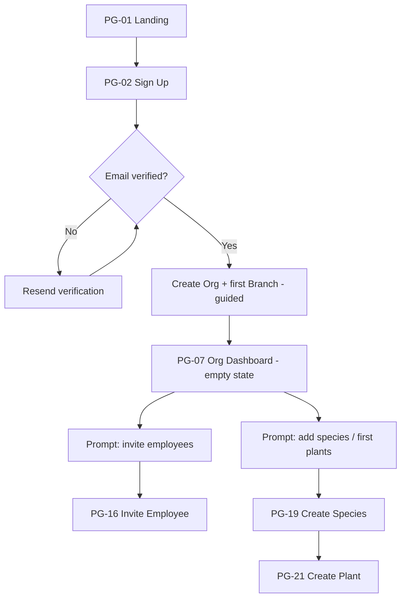
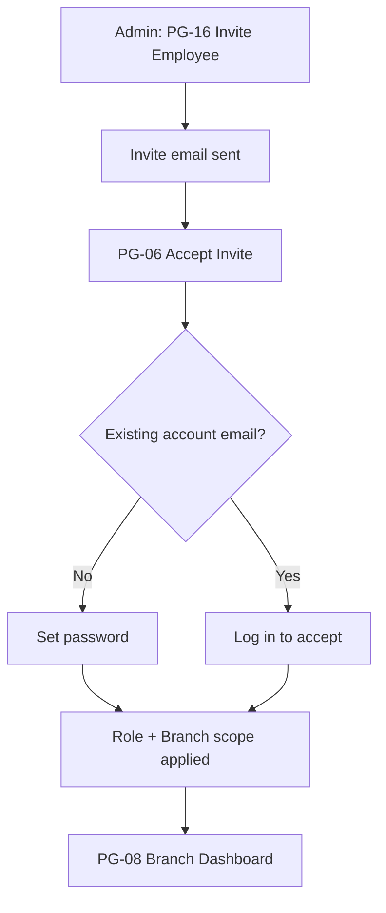
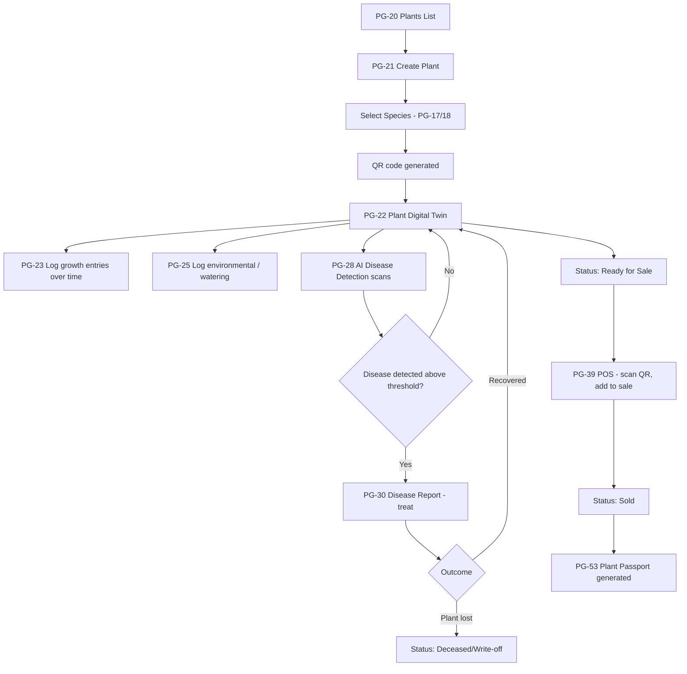
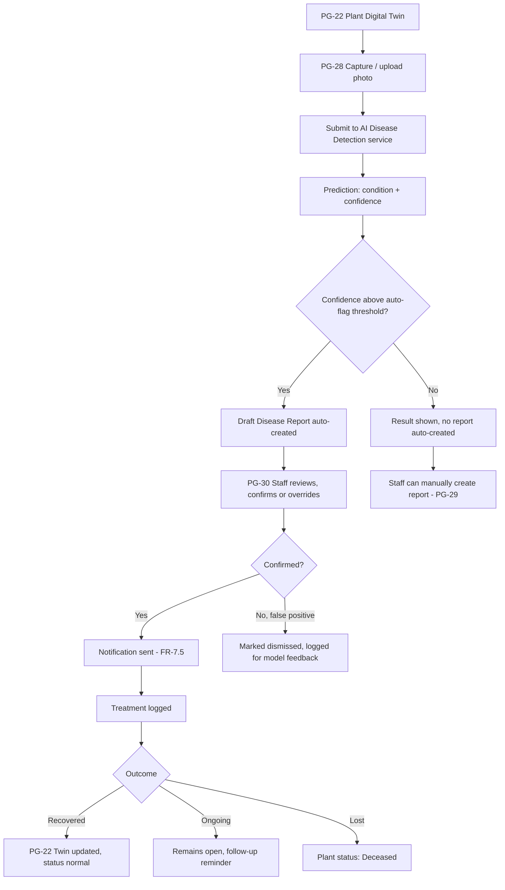
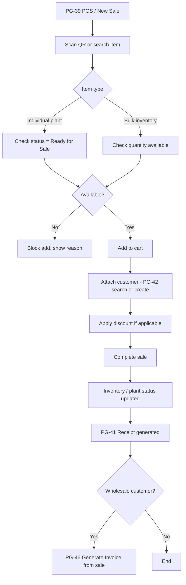
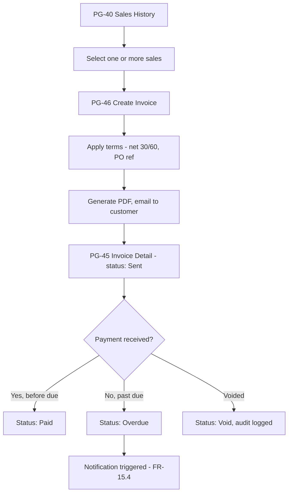
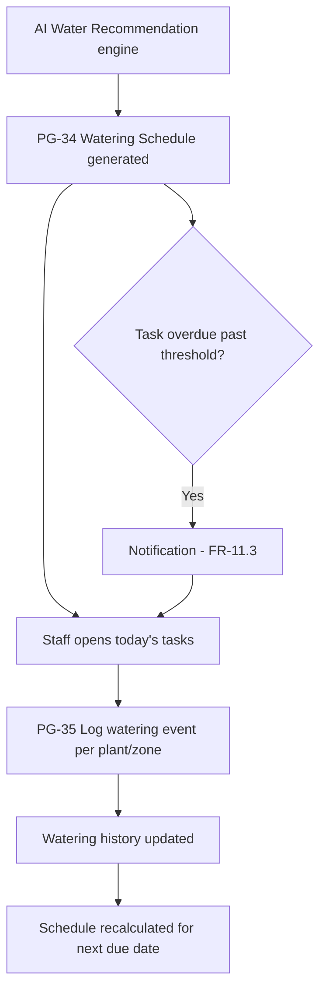
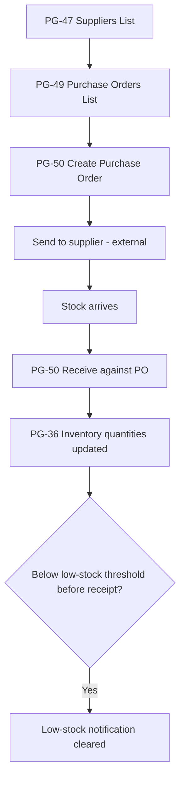

# Screen Flow Diagrams

Flow-level detail for the highest-value multi-screen workflows. Page IDs reference `01-sitemap.md`.

## 1. Onboarding (new Org)

## 2. Employee Invite → First Login

## 3. Plant Creation → Digital Twin → Sale (full lifecycle)

## 4. AI Disease Detection → Treatment (detail)

## 5. POS Sale (Devon's checkout flow)

## 6. Invoice Creation & Tracking

## 7. Watering Task Flow

## 8. Purchasing / Receiving Flow

