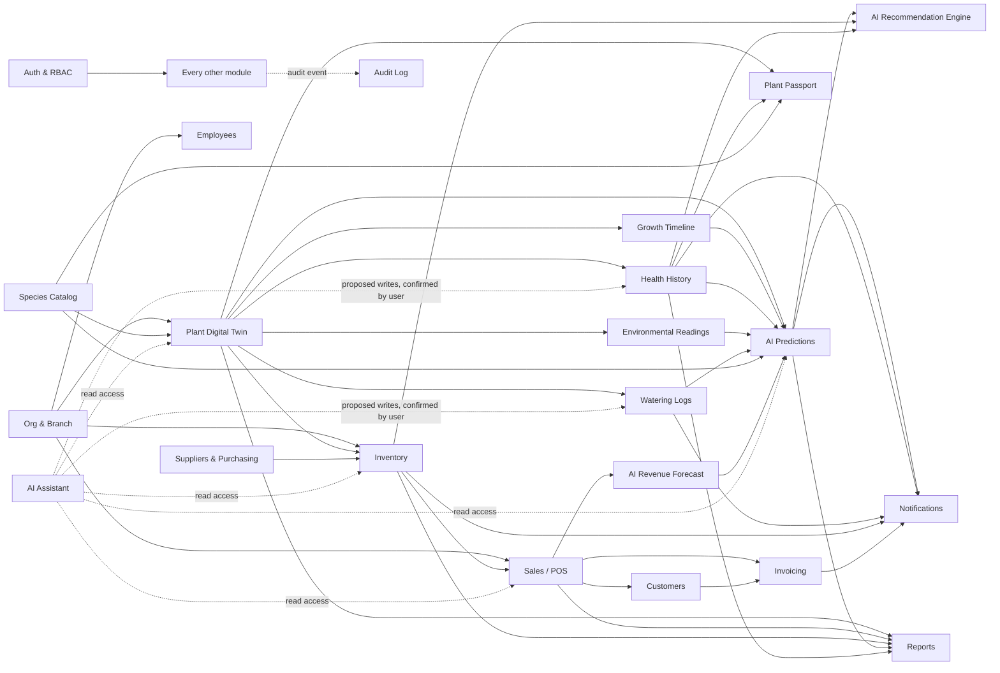

# Module Dependency Diagram

Shows which modules depend on which others for data (not code-level import direction — that's defined in the Enterprise System Architecture, Phase 4). An arrow means "consumes data/events from."

## Dependency Notes

**Foundational modules (everything depends on these):** Auth & RBAC, Org & Branch. No other module functions without tenant/user context resolved first.

**Species Catalog is upstream of Plants:** a plant cannot exist without a species reference (species carries the default care/growth baseline the plant's own history will later override with real data).

**Digital Twin sub-records (Growth, Health, Environmental, Watering) are the primary input to every AI Prediction module** — this is why data-entry friction (NFR-6.1) is treated as a top usability priority: AI quality is directly bounded by how consistently staff log these records.

**AI Predictions is a hub, not a leaf:** it both consumes from the Digital Twin sub-records and feeds Notifications, Reports, the Recommendation Engine, and the Plant Passport. A failure in AI Predictions degrades several downstream features at once, which is why NFR-3.3 (graceful degradation) is scoped specifically around this module.

**Sales is the bridge between the physical/inventory world and the financial world (Customers, Invoicing):** any plant/inventory availability bug surfaces first as a Sales-time error (per FR-13.2), which is why real-time inventory consistency is a Must-have rather than eventually-consistent.

**AI Assistant is a cross-cutting read layer with gated write access:** architecturally it depends on nearly every module for read context, but its write path is intentionally narrow and always human-confirmed (FR-9.3) — it is drawn with dotted lines to distinguish "context access" from the solid-line functional dependencies above.

**Audit Log depends on every module but no module depends on it** — it is a one-way sink, which is intentional (NFR-5.3, FR-19.3: audit entries are never read back into business logic, only into the Audit Log Viewer and compliance exports).
