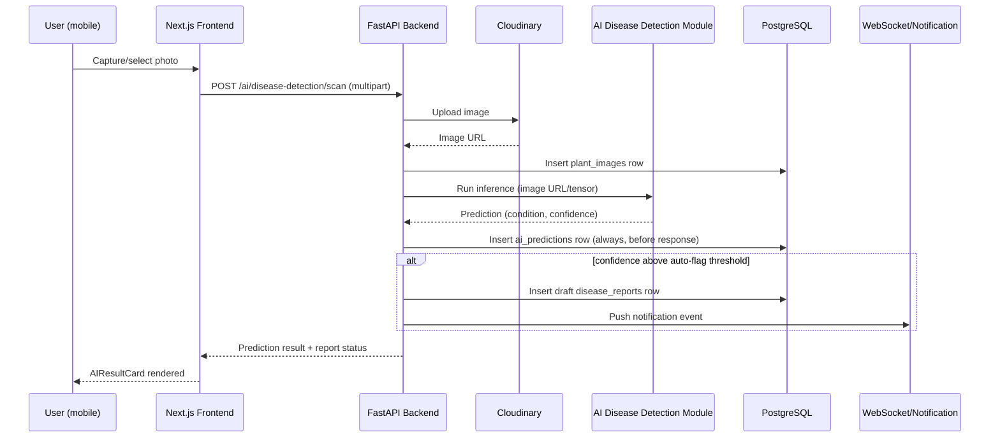
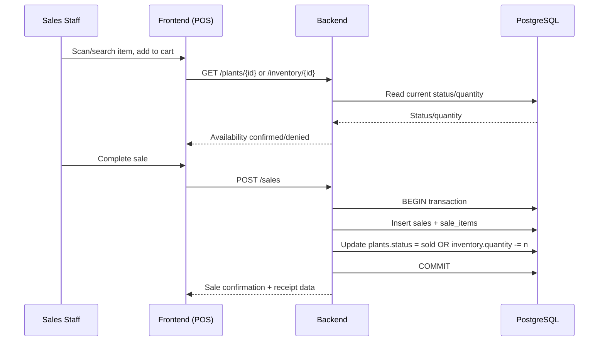
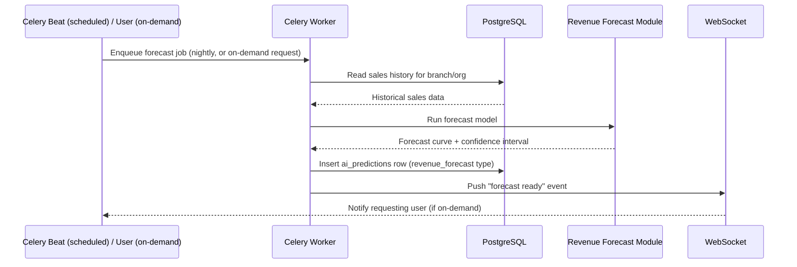
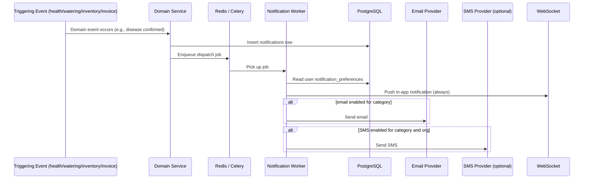
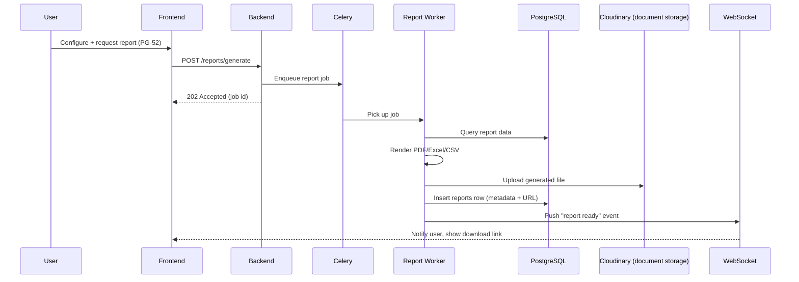
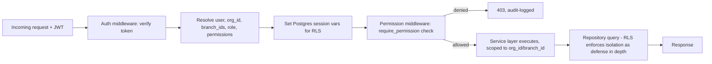

# Data Flow Diagrams

System-level data flow (not UI screen flow — see `03-screen-flow-diagrams.md` for that). These trace how data moves through frontend, API, database, cache, queue, and external services for the highest-value operations.

## 1. Plant Photo Upload → AI Disease Detection (synchronous inference)

## 2. Sale Transaction (inventory consistency path)

The sale-completion write is a single database transaction spanning the sale record and the inventory/plant status update — this is the mechanism behind FR-13.2's "no overselling" guarantee; a failed status update rolls back the sale, not the other way around.

## 3. AI Revenue Forecast (asynchronous, scheduled + on-demand)

## 4. Notification Dispatch (multi-channel fan-out)

## 5. Report Export (long-running, async with completion notification)

## 6. Cross-Cutting: Tenant Scoping on Every Request

Every diagram above assumes this scoping step has already occurred — it is the first thing that happens on every authenticated request and is not repeated in the other diagrams for brevity.
