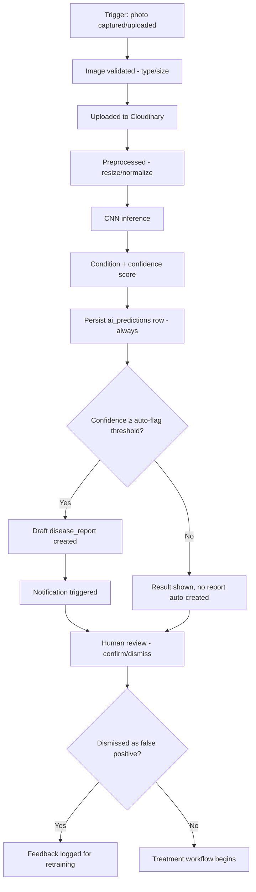
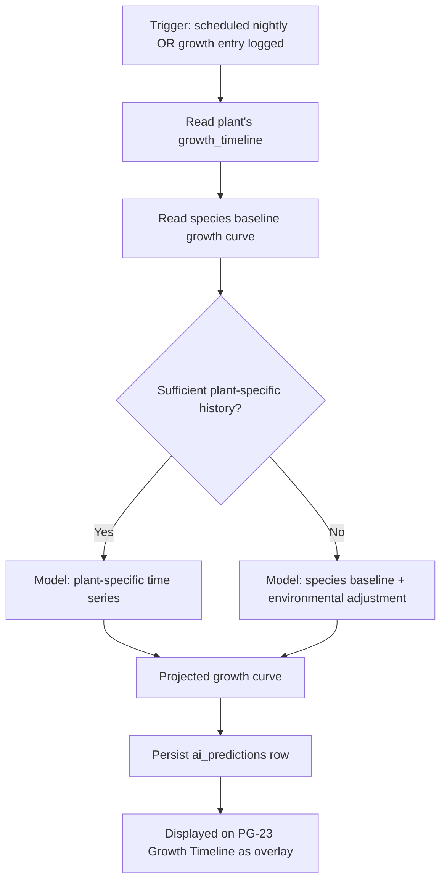
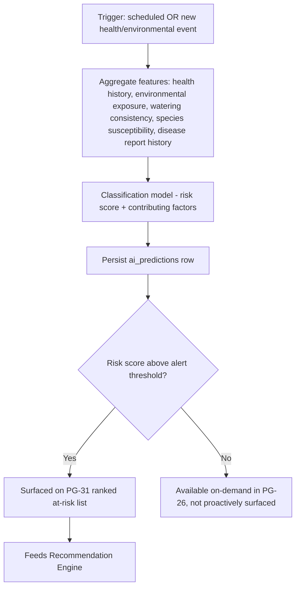
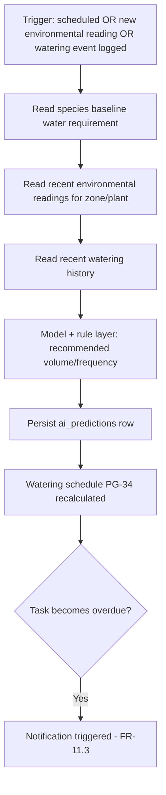
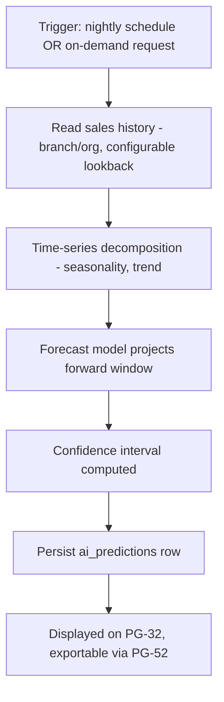
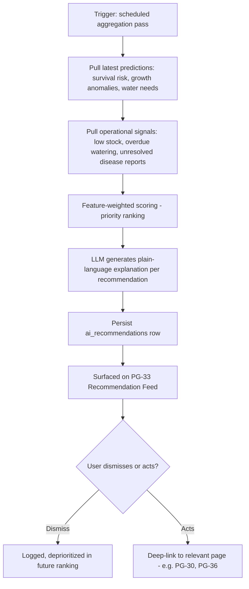
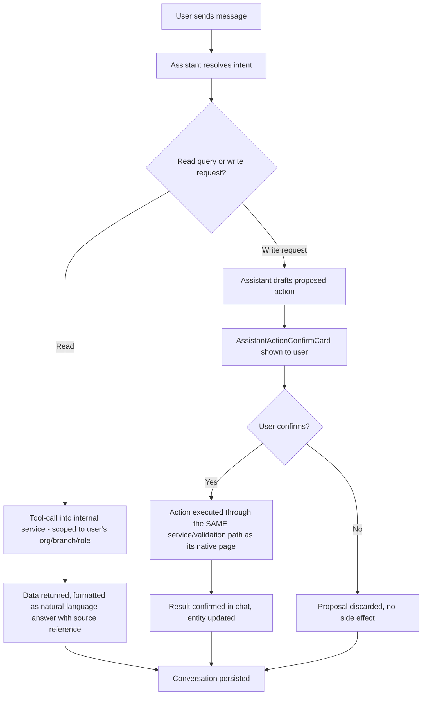

# AI Workflow Diagrams

One workflow per AI module (FR-8, FR-9). Each shows the input → processing → output → persistence path. Model/architecture detail (frameworks, training approach) belongs to Phase 4/8 — this document defines the *workflow contract* those phases implement against.

## 1. Disease Detection

## 2. Growth Prediction

## 3. Survival Prediction

## 4. Water Recommendation

## 5. Revenue Forecast

## 6. Recommendation Engine

## 7. AI Assistant (conversational, tool-using)

The Assistant's write path deliberately reuses each feature's existing service-layer validation (per `11-data-flow-diagrams.md`'s tenant-scoping/permission flow) rather than having its own — this is what keeps FR-9.3's guarantee ("never more capability than the user's role already allows") true by construction rather than by convention.

## AI Prediction Logging Contract (applies to all six modules above)

Every module above shares one non-negotiable rule, restated from FR-8.7: **no AI output reaches a user's screen without first being written to `ai_predictions`** (or `ai_recommendations` for the Recommendation Engine), including `model_version`, a summary of inputs used, the confidence score, and a generated explanation. This is what makes FR-8.8 (historical prediction view) and future model-retraining/accuracy-tracking possible — it is enforced at the service layer, not left to each module's discretion.
