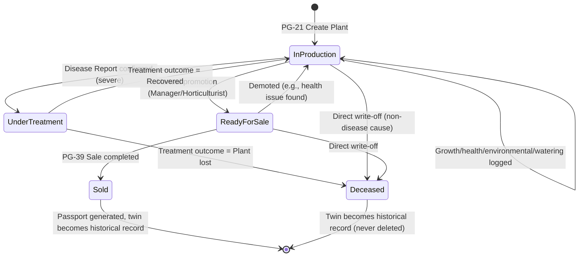

# Plant Digital Twin Lifecycle Flow

The Digital Twin's `status` field is a strict state machine (referenced from PG-22's validation rules). Every transition is timestamped, attributed to a user, and audit-logged (FR-19.1); illegal transitions are blocked at the service layer, not just hidden in the UI.

## State Diagram

## Transition Rules

| From | To | Trigger | Guard conditions | Side effects |
|---|---|---|---|---|
| — | In Production | Plant created (PG-21) | Species and branch required | QR code generated; plant enters growth/health tracking |
| In Production | Ready for Sale | Manual promotion | User has `plants:write`; no open disease report | Becomes visible/eligible in POS (PG-39) |
| Ready for Sale | In Production | Manual demotion | User has `plants:write` | Removed from POS eligibility |
| In Production / Ready for Sale | Under Treatment | Disease report confirmed above severity threshold (FR-7.2/7.5) | Confirmed disease report exists | Notification sent; removed from POS eligibility while under treatment |
| Under Treatment | In Production | Treatment outcome = Recovered (FR-7.3) | Disease report closed with outcome | Health history entry appended |
| Under Treatment | Deceased | Treatment outcome = Plant lost (FR-7.3) | Disease report closed with outcome | Feeds AI Survival Prediction training feedback loop |
| In Production / Ready for Sale | Deceased | Direct write-off (non-disease cause: e.g., weather, accident) | Requires confirmation dialog (NFR-6.3) and a reason | Removed from all active lists; remains queryable in history/reports |
| Ready for Sale | Sold | Sale completed (PG-39, FR-13.3) | Real-time availability check passed (FR-13.2) | Inventory/financial records created; Plant Passport becomes generatable with final status |

## Design Implications Carried Into Later Phases

**Sold and Deceased are terminal but not deleted** — per NFR-4/audit and BRD's provenance requirements, a plant's full twin remains queryable forever after sale or loss; this drives the Phase 5 database decision to use a status field with history, not a soft/hard delete, for these terminal states.

**Under Treatment is the only status that blocks a sale but isn't terminal** — this is why FR-13.2's "real-time availability check" must check status, not just a boolean "in stock" flag; the database schema (Phase 5) needs `status` to be a first-class, indexed, enum-constrained column on `plants`.

**Every transition into Deceased or out of Under Treatment is a labeled outcome, not a free-text field** — this labeled-outcome data is exactly what feeds AI Survival Prediction's training/validation loop (see `12-ai-workflow-diagrams.md` §3), so the lifecycle model and the AI model share the same vocabulary by design.
