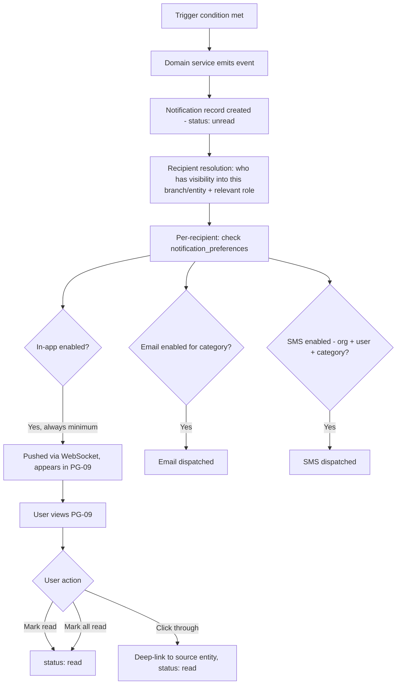

# Notification Workflow

Covers FR-17 end to end: trigger conditions, channel fan-out, and user-facing lifecycle. Dispatch mechanics (queue/worker path) are in `11-data-flow-diagrams.md` §4 — this document defines the business rules that feed that mechanism.

## Trigger Catalog

| Category | Trigger condition | Default channels | Severity |
|---|---|---|---|
| Disease confirmed | Disease report confirmed above severity threshold (FR-7.5) | In-app, Email, SMS (if enabled) | High |
| Watering overdue | Scheduled watering task passes threshold unactioned (FR-11.3) | In-app, Email, SMS (if enabled) | Medium |
| Low stock | Inventory quantity crosses below configured threshold (FR-12.2) | In-app, Email | Medium |
| AI prediction ready | Async prediction (revenue forecast, batch survival scan) completes (FR-8.5 pattern) | In-app | Low |
| Invoice overdue | Invoice passes due date unpaid (FR-15.4) | In-app, Email | Medium |
| Employee invite | New invite sent (system, not alert-driven) | Email only | Info |
| Plant transferred | Plant moved to a branch a user manages | In-app | Low |
| Purchase order received | Stock received against a PO | In-app | Low |

## Lifecycle

## Recipient Resolution Rules

Notifications are never broadcast org-wide by default — recipient resolution follows the same branch-scoping as the permission matrix: a branch-level trigger (disease, watering, low stock) notifies users with `read` access to that branch and the relevant module permission (e.g., disease notifications go to users with `disease:read` in that branch, not to Sales Staff). Owner/Org Admin receive all org-wide categories (invoice overdue, employee invite) plus an optional daily/weekly digest of branch-level alerts (configurable in PG-58) rather than every individual branch alert in real time, to avoid alert fatigue for multi-branch operators — this directly serves Renata's persona goal of "proactively alerted... without being overwhelmed."

## Escalation

A Disease Confirmed or Watering Overdue notification that remains unread for a configurable window (default 4 hours for High severity) re-notifies via the next-priority channel not yet used (e.g., in-app-only escalates to email) — this is a v1.1 enhancement flagged in the roadmap (BRD §10) but the trigger/channel model above is built to support it without rearchitecting.

## User Control

Per FR-17.4, every category × channel combination is independently toggleable in PG-58, except: In-app is always-on for High severity categories (cannot be fully disabled, only the redundant channels can be), and SMS is gated both by org-level enablement (PG-59, plan-gated per BRD §5) and per-user opt-in.
