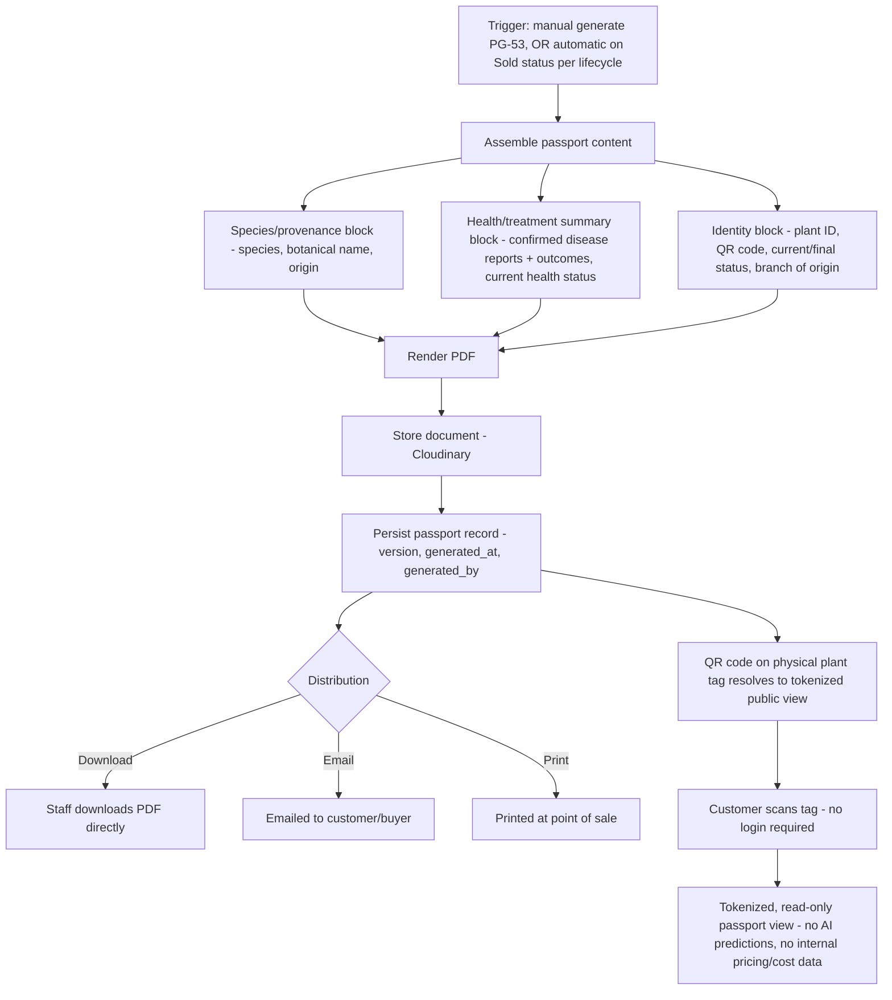

# Plant Passport Workflow

Covers FR-18.1 / US-G.1 end to end — generation, content assembly, distribution, and the customer-facing access path.

## Workflow Diagram

## Content Rules

The passport is a **factual, point-in-time document**, not a live dashboard: it captures a snapshot at generation time (species/provenance, health/treatment history summary, status) and explicitly excludes speculative content — no AI predictions, no internal cost/margin data, no other customers' information. This distinction (factual vs. speculative) is why the AI Predictions tab (PG-26) and the Passport (PG-53) are architecturally separate views over the same underlying plant even though both "summarize" the plant's history — the passport's job is defensible provenance, not forecasting.

## Versioning

Each generation creates a new immutable passport version rather than overwriting the previous one — relevant when a plant is re-passported after a status change (e.g., regenerated at time of sale with final treatment outcomes included, superseding an earlier "ready for sale" version). All versions remain retrievable from the plant's Digital Twin (PG-22) for audit purposes, even though only the latest is customer-facing by default.

## Public/Tokenized Access Path

Because the passport must be viewable by a customer scanning a physical QR tag with no NurseryVerse account, the public view is served through a signed, time-scoped token (not the plant's raw internal ID) — this requirement is carried into Phase 4/6 as an explicit "public read, tenant-safe" endpoint pattern distinct from every other authenticated API route in the system, and is the one deliberate exception to the "every request is tenant-scoped and authenticated" rule stated in `11-data-flow-diagrams.md` §6.

## Compliance Note

Per SRS §6 ("Other Requirements"), the passport's field set is designed to cover what's typically required for phytosanitary/wholesale documentation, but exact jurisdiction-specific certification remains the customer/regulator's responsibility — the passport is evidence, not a certification the system issues on a regulator's behalf.
