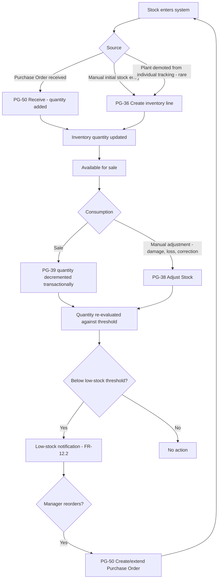

# Inventory Workflow

Covers FR-12 — bulk stock, separate from but interoperating with the Digital Twin (FR-5.6) and Purchasing (FR-16). Page references: PG-36/37/38 (inventory), PG-49/50 (purchase orders), PG-39 (sales consumption).

## End-to-End Workflow

## Consistency Guarantees

Every quantity-changing operation (sale, adjustment, PO receipt) is a single database transaction against the `inventory` row — this is the same transactional pattern used for individual-plant status changes in the sale flow (`11-data-flow-diagrams.md` §2), applied here to bulk quantities. A sale that partially succeeds (payment recorded but inventory decrement fails) is not possible; the whole transaction rolls back and the sale is not created, surfaced to the user as a retryable error (NFR-6.2).

## Threshold Model

Low-stock thresholds are set per inventory line at the Branch level (FR-20.2 branch settings), not a single global default — this matters because two branches carrying the same species/product may have very different turnover rates and shelf-space constraints; a single org-wide threshold would produce false alerts at a high-volume branch and missed alerts at a low-volume one.

## Manual Adjustment Rules

`Adjust Stock` (PG-38) requires a reason code (damage, count correction, internal use, other) — this is not free-text-optional, because adjustment reason data is what later differentiates "we sold more than the system thought" (a process problem) from "plants died in transit" (a supply-chain problem) when Renata reviews branch performance. Every adjustment is audit-logged (FR-19.1) with before/after quantity.

## Relationship to the Digital Twin

Inventory (bulk, uncounted individually) and Plants (individually tracked digital twins) are deliberately separate models rather than one merged with a "tracking granularity" flag — per `08-information-architecture.md` §3, this keeps the common case (most nursery stock is bulk — flats of annuals, bags of soil, small pots) fast and lightweight, while reserving the heavier Digital Twin machinery (growth timeline, AI predictions, passport) for the specimen/high-value plants that actually benefit from it. A nursery is not required to individually track every plant to use the system.
