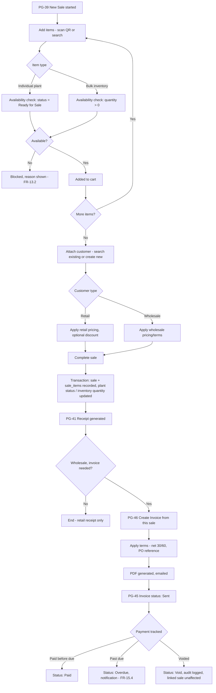

# Sales Workflow

Covers FR-13, FR-14, FR-15 together — Sale → Customer → Invoice is one connected commercial flow, referenced separately in the page inventory (PG-39–46) but specified here as a single business process.

## End-to-End Workflow

## Retail vs. Wholesale Branch Logic

The workflow forks on customer classification (FR-14.1) at the point of attaching a customer, not earlier — this is deliberate: Devon (Sales Staff) doesn't need to know in advance whether a walk-in is retail or wholesale before scanning items, so the cart-building experience (US-F.1, US-F.2) is identical for both; only pricing/terms and the optional invoice step diverge afterward. This keeps POS fast for the high-frequency retail case while still supporting the B2B case without a separate screen.

## Void & Correction Path

A completed sale can be voided (PG-41, `sales:void`) but never edited in place — voiding reverses the inventory/plant-status effect and requires a reason (NFR-6.3), consistent with the append-only/lifecycle distinction in `08-information-architecture.md` §3 (a Sale has a lifecycle: completed → voided, it does not silently mutate). An invoice already generated from a voided sale is not automatically voided — Manager/Admin must explicitly void the invoice too, since the customer relationship (they may still owe for other items on a multi-sale invoice) isn't automatically resolved by voiding one underlying sale.

## Data Feeding Other Modules

This workflow is the primary data source for: Revenue Forecast (`12-ai-workflow-diagrams.md` §5, reads `sales`), the Customer purchase-history view (PG-43), and the org/branch dashboards' revenue widgets (PG-07/08). No other module writes to `sales` — this single-writer property is what keeps the Revenue Forecast model's training data trustworthy.
