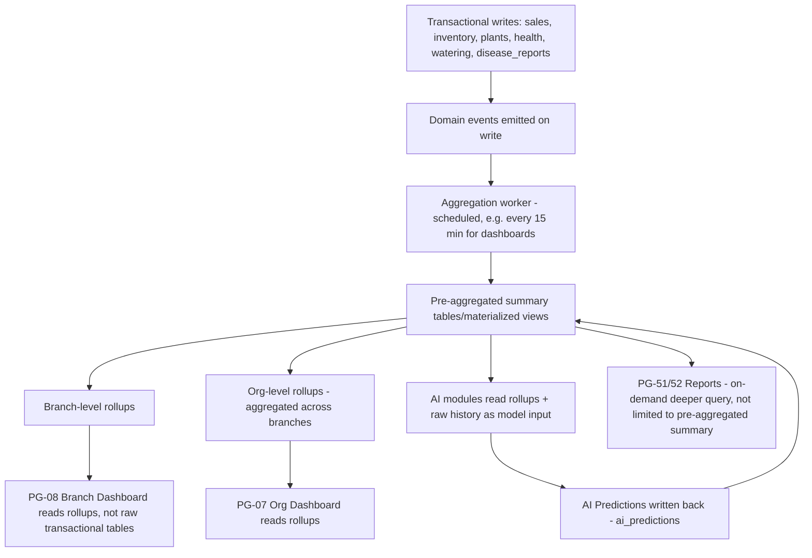

# Analytics Workflow

Covers how raw operational data becomes the summary figures shown on PG-07/08 dashboards, PG-31–33 AI Center, and PG-51/52 Reports — the aggregation layer that sits between transactional data and what users actually see.

## Aggregation Pipeline

## Why Pre-Aggregation (not live-query-every-dashboard-load)

Dashboard load-time NFR-1.3 (primary content within 2 seconds) is not achievable by summing raw `sales`/`inventory`/`health_history` rows on every request once an Org has meaningful data volume (NFR-2.2's tens-of-thousands-of-plant-records scale). Dashboards read from scheduled rollups refreshed on a short interval (target: 15 minutes, tunable) rather than computing live — this is an explicit tradeoff of near-real-time freshness for guaranteed responsiveness, distinct from the fully real-time WebSocket path used for Notifications (`14-notification-workflow.md`) and inventory-at-checkout (`17-sales-workflow.md`), which must be instantaneous and therefore query live, transactional data, not rollups.

## Metrics Catalog

| Metric | Rollup grain | Source | Consumed by |
|---|---|---|---|
| Revenue (period) | Branch, Org | `sales` | PG-07, PG-08, PG-32 |
| Plant loss rate | Branch, Org, Species | `plants` status transitions to Deceased | PG-07, PG-51 (Plant Loss report) |
| AI-flagged at-risk count | Branch | `ai_predictions` (survival) | PG-07, PG-08, PG-31 |
| Inventory alerts count | Branch | `inventory` vs. thresholds | PG-08 |
| Disease incidence trend | Branch, Org, Species | `disease_reports` | PG-51 (AI Summary report) |
| Prediction accuracy over time | Org, per AI module | `ai_predictions` vs. observed outcomes | PG-51 (AI Summary report) — supports BRD Goal 3 (forecasting accuracy tracking) |
| Watering compliance rate | Branch | `watering_logs` vs. scheduled tasks | PG-08 |
| Average time-to-sale | Branch, Species | `plants` creation-to-sold duration | PG-51 |

## Prediction Accuracy Tracking (supports BRD Goal 3)

Because every AI prediction is persisted with its inputs and confidence (FR-8.7) and every plant/branch outcome is eventually observed (a survival-risk prediction is later confirmed or contradicted by the plant's actual outcome; a revenue forecast is later compared to actual sales), the analytics pipeline includes a dedicated accuracy-tracking rollup: predicted-vs-actual comparison, computed once the relevant outcome window has closed. This is what lets the AI Summary report (FR-18.3) show "our survival predictions have been X% accurate over the last quarter" rather than presenting AI output as an unverifiable black box — directly operationalizing BRD Business Goal 3's "revenue forecast within 15% of actuals" target as a trackable, reportable number rather than an aspiration.

## Report vs. Dashboard Distinction

Reports (PG-51/52) are allowed to query deeper/wider than the pre-aggregated rollups (e.g., a custom date range or cross-species breakdown not pre-computed) because they are already asynchronous by design (`11-data-flow-diagrams.md` §5) — the 2-second dashboard constraint doesn't apply, so reports trade a short generation wait for query flexibility the dashboards deliberately don't offer.
